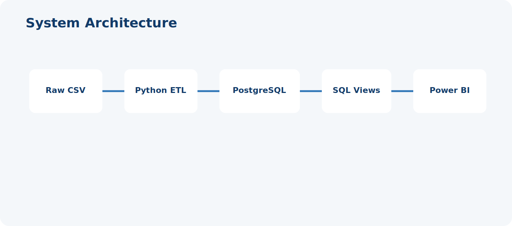
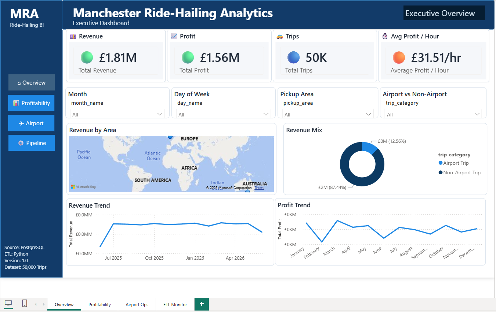
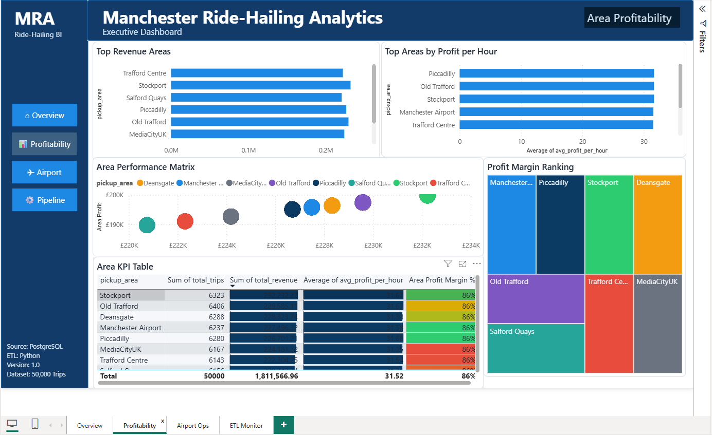
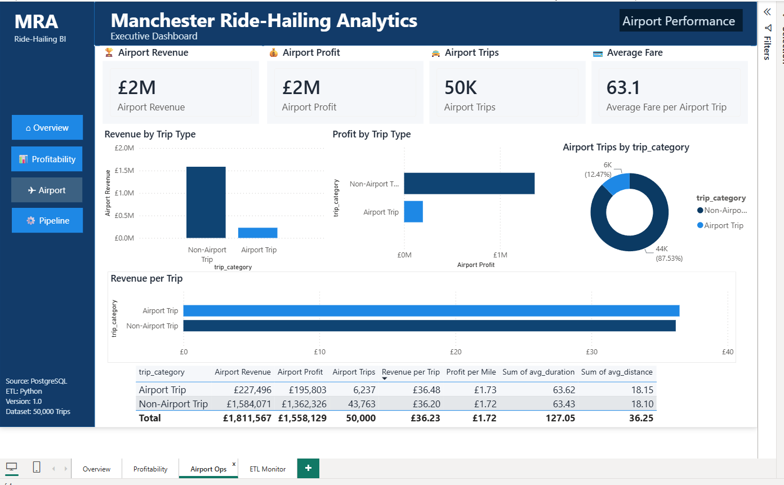
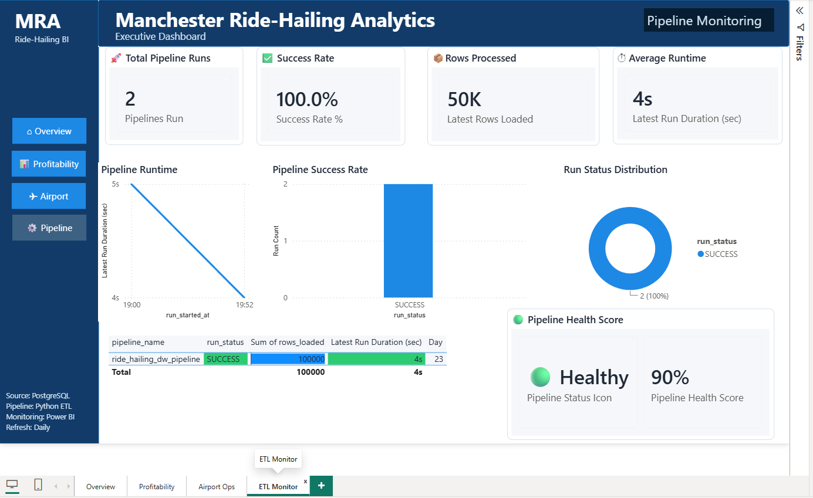

# Manchester Ride-Hailing Data Warehouse

<p align="center">
  
</p>

<p align="center">
  <b>End-to-End Data Engineering & Business Intelligence Platform</b><br>
  Python ETL • PostgreSQL Data Warehouse • SQL Views • Power BI Dashboards • ETL Monitoring
</p>

<p align="center">
  
  
  
  
  
</p>

---

## Project Overview

**Manchester Ride-Hailing Data Warehouse** is an end-to-end data engineering and business intelligence project that simulates a production reporting platform for a ride-hailing business.

The project ingests trip data, cleans and transforms it using Python, loads it into PostgreSQL, exposes analytical SQL views, and connects the warehouse to Power BI dashboards covering executive reporting, area profitability, airport operations, and ETL monitoring.

---

## Business Problem

Ride-hailing businesses generate large volumes of operational data. Without a central analytics layer, business users struggle to answer questions such as:

- How much revenue and profit is the business generating?
- Which pickup areas are most profitable?
- Are airport trips more valuable than non-airport trips?
- Is the ETL pipeline running successfully?
- How quickly is data being processed?

This project turns raw trip records into a structured analytics platform for decision-making.

---

## Solution Architecture

<p align="center">
  
</p>

The platform follows a realistic analytics architecture:

1. Raw CSV data
2. Python ETL
3. PostgreSQL warehouse
4. SQL analytical views
5. Power BI semantic model
6. Four business dashboards

---

## Dashboard Showcase


### Executive Overview



High-level KPIs, revenue and profit trends, revenue by area, and airport revenue mix.

### Area Profitability



Pickup area revenue, profit per hour, revenue vs profit matrix, margin treemap, and detailed KPI table.

### Airport Performance



Airport vs non-airport revenue, profit, trips, average fare, and revenue per trip.

### ETL Monitoring



Pipeline executions, rows loaded, ETL runtime, health score, runtime trend, and status distribution.

---


## Power BI Assets

├── Manchester-Ride-Hailing-Warehouse.pbix
      Standalone Power BI dashboard

├── Manchester-Ride-Hailing-Warehouse.pbip
      Source-controlled Power BI project

├── Manchester-Ride-Hailing-Warehouse.Report/
      Report definition

└── Manchester-Ride-Hailing-Warehouse.SemanticModel/
      Semantic model

---

## Repository Structure

```text
Manchester-Ride-Hailing-Data-Warehouse/
├── README.md
├── LICENSE
├── requirements.txt
├── .gitignore
├── assets/
│   ├── diagrams/
│   └── screenshots/
├── docs/
├── dashboards/
├── sql/
├── src/
└── data/
```

---

## Technology Stack

| Layer | Technology | Purpose |
|---|---|---|
| Data Processing | Python, Pandas | Cleaning, transformation, validation |
| Database | PostgreSQL | Central warehouse storage |
| Query Layer | SQL Views | Business-ready reporting layer |
| Dashboarding | Power BI | Executive and operational reporting |
| Monitoring | Pipeline audit table | ETL execution tracking |
| Version Control | Git, GitHub | Project management |

---

## Core KPIs

| KPI | Description |
|---|---|
| Total Revenue | Total revenue generated from trips |
| Total Profit | Revenue after cost deductions |
| Total Trips | Number of trips completed |
| Average Profit / Hour | Operational profitability per hour |
| Revenue per Trip | Average revenue generated per trip |
| Profit Margin % | Profit divided by revenue |
| Airport Revenue | Revenue generated from airport trips |
| Airport Profit | Profit generated from airport trips |
| Pipeline Executions | Number of ETL runs |
| Rows Loaded | Records processed by the pipeline |
| Pipeline Health Score | Operational health indicator for ETL success |

---

## ETL Workflow

<p align="center">
  
</p>

The ETL process extracts source data, validates input fields, transforms business metrics, loads PostgreSQL, and writes audit logs for monitoring.

---

## PostgreSQL Data Model

<p align="center">
  
</p>

Reporting views include:

- `public.vw_daily_performance`
- `public.vw_area_profitability`
- `public.vw_airport_performance`
- `public.vw_hourly_performance`
- `public.pipeline_audit`

---

## How to Run

```bash
git clone https://github.com/YOUR_USERNAME/Manchester-Ride-Hailing-Data-Warehouse.git
cd Manchester-Ride-Hailing-Data-Warehouse
python -m venv .venv
.venv\Scripts\activate
pip install -r requirements.txt
```

Create PostgreSQL database and run SQL scripts:

```bash
psql -d ride_hailing_dw -f sql/schema.sql
psql -d ride_hailing_dw -f sql/views.sql
```

Run the ETL pipeline:

```bash
python src/load.py
```

Open the Power BI report in the `dashboards/` folder and update PostgreSQL connection settings if required.

---

## Key Skills Demonstrated

- Python ETL
- PostgreSQL data warehousing
- SQL analytics views
- Power BI dashboard design
- DAX measures
- KPI reporting
- Pipeline monitoring
- Business intelligence storytelling
- GitHub documentation

---

## Future Enhancements

- Docker Compose setup
- dbt transformations
- Airflow or Prefect orchestration
- Incremental loading
- Automated data quality checks
- Power BI Service deployment
- CI/CD pipeline
- Cloud-hosted PostgreSQL

---

## Author

**Babacar Ba**  
Data Engineering & Business Intelligence Portfolio Project
